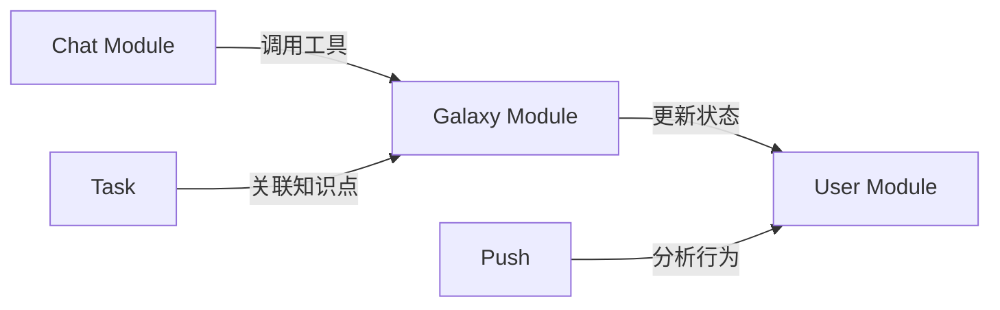

# Sparkle 框架概览与模块关系

> **版本**: v2.0
> **日期**: 2026-01-10
> **架构**: 混合微服务 (Flutter + Go + Python)

## 1. 项目整体架构

Sparkle 项目采用 **三层混合微服务架构**，旨在结合 Go 的高并发能力和 Python 的 AI 生态优势，同时为移动端提供极致的 Flutter 体验。

- **移动端 (Flutter)**: 跨平台应用，负责 UI 渲染、本地状态管理和实时交互。
- **网关层 (Go Gateway)**: 高性能接入层，负责 WebSocket 维持、请求路由、鉴权和基础数据读写。
- **智能层 (Python Engine)**: AI 业务核心，负责 LLM 编排、RAG 检索、复杂计算和异步任务。

---

## 2. 后端架构设计 (Backend Architecture)

### 2.1 网关层 (Go)
- **Framework**: Gin (Web), Gorilla (WebSocket)
- **职责**:
    - **Session Management**: 维护数万级 WebSocket 长连接。
    - **Authentication**: JWT 验证，统一鉴权。
    - **Protocol Conversion**: 将 WebSocket 消息转换为 gRPC 流。
    - **Direct DB Access**: 处理高频、简单的 CRUD 操作 (如获取历史记录)。

### 2.2 智能层 (Python)
- **Framework**: FastAPI (REST Management), gRPC (Internal)
- **职责**:
    - **LLM Orchestration**: 使用 LangChain 管理 Agent 思考过程。
    - **RAG Engine**: 基于 pgvector 的知识库检索。
    - **Async Tasks**: 使用 Celery 处理耗时任务 (Embedding 生成、文件分析)。

### 2.3 数据访问层 (Shared)
- **PostgreSQL 16**: 核心关系型数据库。
- **pgvector**: 向量存储扩展。
- **Redis 7**: 缓存、会话存储和任务队列 Broker。

---

## 3. 前端架构设计 (Frontend Architecture)

### 3.1 核心层级
- **Feature-First**: 按功能模块组织代码 (Auth, Chat, Galaxy)。
- **Riverpod**: 响应式状态管理，解耦 UI 与逻辑。
- **Design System V2**: 基于 Token 的语义化设计系统，支持 NeoGlass 等高级材质。

### 3.2 关键组件
- **WebSocketService**: 处理重连、心跳和消息分发。
- **PerformanceService**: 动态监控 FPS，自适应调整渲染质量。
- **GalaxyRender**: 基于 Shader 的高性能星图渲染引擎。

---

## 4. 模块功能与关系

### 4.1 核心模块

| 模块 | 职责 | 依赖关系 | 前端组件 |
| :--- | :--- | :--- | :--- |
| **User (用户)** | 认证、资料、偏好 | 基础模块 | `AuthScreen`, `ProfileScreen` |
| **Galaxy (星图)** | 知识点管理、可视化、遗忘曲线 | 依赖 User, Chat | `GalaxyScreen`, `FlameCore` |
| **Chat (对话)** | AI 交互、工具调用、流式响应 | 依赖 User, Galaxy | `ChatScreen`, `ChatBubble` |
| **Task (任务)** | 任务创建、执行、完成 | 依赖 User, Galaxy | `TaskListScreen`, `FocusMode` |
| **Push (推送)** | 智能通知、唤醒策略 | 依赖 User, Plan | (系统通知) |

### 4.2 模块间通信



---

## 5. 数据流与交互关系

### 5.1 实时对话流
```
Flutter (WS) <--> Go Gateway (gRPC Stream) <--> Python Engine (LangChain)
```

### 5.2 知识点点亮
```
Flutter (REST) --> Go Gateway (SQL) --> DB (Update Mastery)
       |
       +--> (Async Event) --> Python Engine (Celery) --> 生成关联推荐
```

### 5.3 向量检索
```
Python Engine (Embedding) --> DB (pgvector)
       ^
       |
Flutter (Search Query) --> Go Gateway --> Python Engine (Search)
```

---

## 6. 扩展性与维护性

### 6.1 协议解耦
Go 与 Python 之间通过 `protobuf` 定义严格接口，任一方升级不影响另一方，只要接口兼容。

### 6.2 独立扩容
- **Gateway**: 计算轻量，可部署多副本抗并发。
- **Engine**: 计算密集，可独立部署在 GPU 实例上。
- **Worker**: 纯异步，可根据队列积压情况弹性伸缩。

### 6.3 统一监控
全链路接入 Prometheus + Grafana，统一监控 QPS、延迟和错误率。