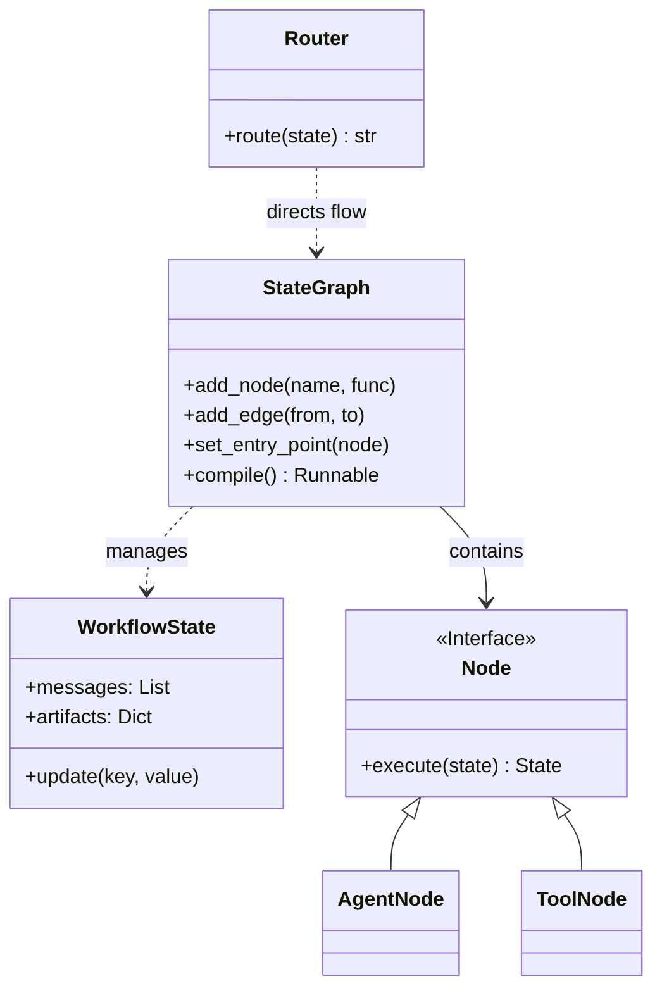
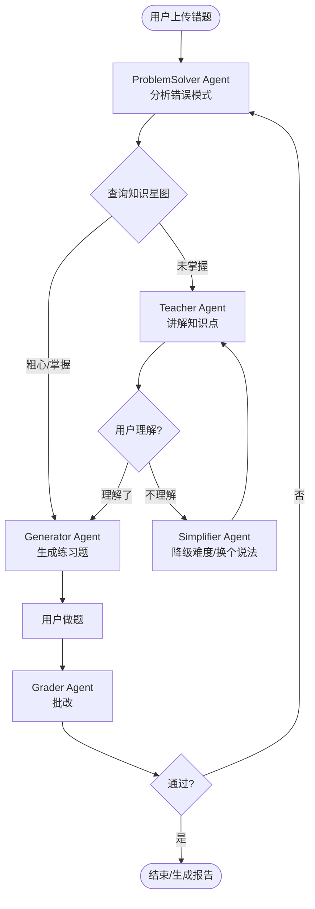

# 多智能体协作系统架构升级方案 (v3.0) - 动态状态图引擎

> **版本**: v3.0 (Draft)
> **日期**: 2025-12-28
> **作者**: Sparkle AI Architecture Team
> **状态**: 规划中

---

## 1. 核心变革：从过程式到动态图

### 1.1 现状分析 (v2.0)
目前的 `Enhanced Multi-Agent System v2.0` 虽然实现了多专家协作，但底层架构采用的是**硬编码的过程式工作流** (`Procedural Workflows`)。

**现有局限性：**
- **线性僵化**：流程通常是 `Step 1 -> Step 2 -> Step 3`，难以处理复杂的循环反馈（例如：用户对 Step 3 不满意，需要退回 Step 1 修改参数）。
- **状态分散**：上下文状态 (`EnhancedAgentContext`) 只是一个数据容器，缺乏版本控制和状态演进追踪。
- **扩展困难**：新增一个决策分支需要修改主流程代码，违反开闭原则。
- **容错性弱**：缺乏细粒度的错误恢复机制，一旦中间环节出错，通常只能整体重试。

### 1.2 改进目标 (v3.0)
引入 **Dynamic State Graph (动态状态图)** 架构，将多智能体协作建模为有向图（Graph），其中：
- **节点 (Nodes)**：执行单元（Agents 或 Tools）。
- **边 (Edges)**：控制流，可以是确定性的，也可以是基于条件的（Conditional Edges）。
- **状态 (Shared State)**：在节点间流转的全局黑板。

这种架构深受业界最先进模式（如 LangGraph, AutoGen GroupChat, StateCharts）的启发，专门针对 Sparkle 的教育场景进行了轻量化适配。

---

## 2. 动态状态图架构设计

### 2.1 核心组件

#### 1. Shared State (全局状态黑板)
一个类型化的数据类，包含对话历史、中间产物、决策标志等。它是图的"血液"。

```python
@dataclass
class WorkflowState:
    messages: List[BaseMessage]      # 对话历史
    current_plan: Optional[str]      # 当前学习计划
    artifacts: Dict[str, Any]        # 生成的工件（题目、代码等）
    errors: List[str]                # 错误堆栈
    user_feedback: Optional[str]     # 用户反馈
    next_step: str                   # 下一步指示
    metadata: Dict[str, Any]         # 额外元数据
```

#### 2. Nodes (执行节点)
图中的顶点，负责执行具体任务并更新 State。

- **AgentNode**: 封装 LLM Agent，处理复杂逻辑。
- **ToolNode**: 执行确定性代码（如查询数据库、计算）。
- **HumanNode**: 等待用户输入（Human-in-the-loop）。

#### 3. StateGraph (状态图引擎)
负责定义图结构、编译图并管理执行运行时。

```python
class StateGraph:
    def add_node(self, name: str, action: Callable): ...
    def add_edge(self, from_node: str, to_node: str): ...
    def add_conditional_edges(self, source: str, path_map: Dict[str, str], condition: Callable): ...
    def compile(self): ...
```

---

## 3. 架构可视化

### 3.1 核心类图



### 3.2 错题诊断循环 (Error Diagnosis Loop) - 改进版

在 v3.0 中，错题诊断不再是线性的，而是一个闭环系统，支持**自适应难度调节**。



> **创新点**：
> 1. **Simplifier 回路**：当用户反馈不理解时，系统自动进入降级模式，而不是重复同样的话。
> 2. **Grader 闭环**：做题结果直接反馈给 Analyzer，形成真正的“诊断-治疗-验证”闭环。

---

## 4. 关键技术实现方案

### 4.1 轻量级图引擎实现 (Python)

我们不需要引入沉重的第三方库，可以使用 Python 原生特性实现一个轻量级引擎：

```python
class GraphRunnable:
    def __init__(self, nodes, edges, entry_point):
        self.nodes = nodes
        self.edges = edges
        self.entry_point = entry_point
        
    async def invoke(self, initial_state):
        current_node = self.entry_point
        state = initial_state
        
        while current_node != "__end__":
            # 1. 执行当前节点
            node_func = self.nodes[current_node]
            new_state = await node_func(state)
            
            # 2. 状态合并（支持增量更新）
            state = {**state, **new_state}
            
            # 3. 决定下一跳
            if current_node in self.edges:
                next_dest = self.edges[current_node]
                
                # 处理条件边
                if callable(next_dest):
                    current_node = next_dest(state)
                else:
                    current_node = next_dest
            else:
                current_node = "__end__"
                
        return state
```

### 4.2 状态持久化与“人机回环”

为了支持长流程（例如：跨越几天的学习计划制定），我们需要支持状态持久化。

```python
class Checkpointer:
    """负责保存和恢复图执行状态"""
    async def save(self, thread_id: str, state: WorkflowState):
        # 保存到 Redis/Postgres
        pass
        
    async def load(self, thread_id: str) -> WorkflowState:
        # 加载状态
        pass

# 使用示例
# 用户暂停了会话，第二天回来继续
state = await checkpointer.load("session_123")
graph.resume(state, next_node="UserFeedback")
```

---

## 5. 业务场景升级案例

### 场景：渐进式深度探索 (Progressive Exploration)

**旧版 (v2.0)**:
Math -> Code -> Science -> Writing -> Planner (固定顺序)

**新版 (v3.0)**:
由一个 **Conductor Agent (指挥家)** 动态决定下一步。

1. **MathAgent** 输出推导。
2. **Conductor** 检查输出复杂度。
   - 如果太深奥 -> 插入 **AnalogyAgent** (打比方)。
   - 如果很直观 -> 跳过 Science，直接去 Code。
3. **CodeAgent** 生成代码。
4. **Conductor** 询问用户：“需要运行这段代码看结果吗？” (Human-in-the-loop)
   - 用户选“是” -> 调用 **CodeInterpreter** 工具执行。
   - 用户选“否” -> 继续生成笔记。

这种动态性极大地提升了用户体验，使 AI 看起来更“聪明”且“懂我”。

---

## 6. 实施路线图

### Phase 1: 基础设施建设 (Week 1)
- [ ] 实现基础 `StateGraph` 引擎。
- [ ] 定义通用 `WorkflowState` 数据结构。
- [ ] 建立 `Checkpointer` 持久化机制。

### Phase 2: 核心工作流迁移 (Week 2)
- [ ] 将 `ErrorDiagnosisWorkflow` 重构为图结构。
- [ ] 增加 `Simplifier` 和 `Grader` 节点。
- [ ] 在开发环境进行闭环测试。

### Phase 3: 高级特性与集成 (Week 3)
- [ ] 实现前端可视化组件（实时显示图执行状态）。
- [ ] 集成 Human-in-the-loop 交互（前端弹窗确认）。
- [ ] 上线 A/B 测试，对比 v2.0 和 v3.0 的用户满意度。

---

## 7. 结论

v3.0 动态状态图架构不仅是对现有代码的重构，更是系统智能程度的质变。它将死板的“工序”变成了灵活的“对话”，赋予了 Sparkle 真正的**元认知能力**（知道自己在做什么，并在遇到困难时调整策略）。

该方案利用现有的 Python 技术栈即可实现，无需引入不可控的外部依赖，具有极高的可行性和扩展性。
