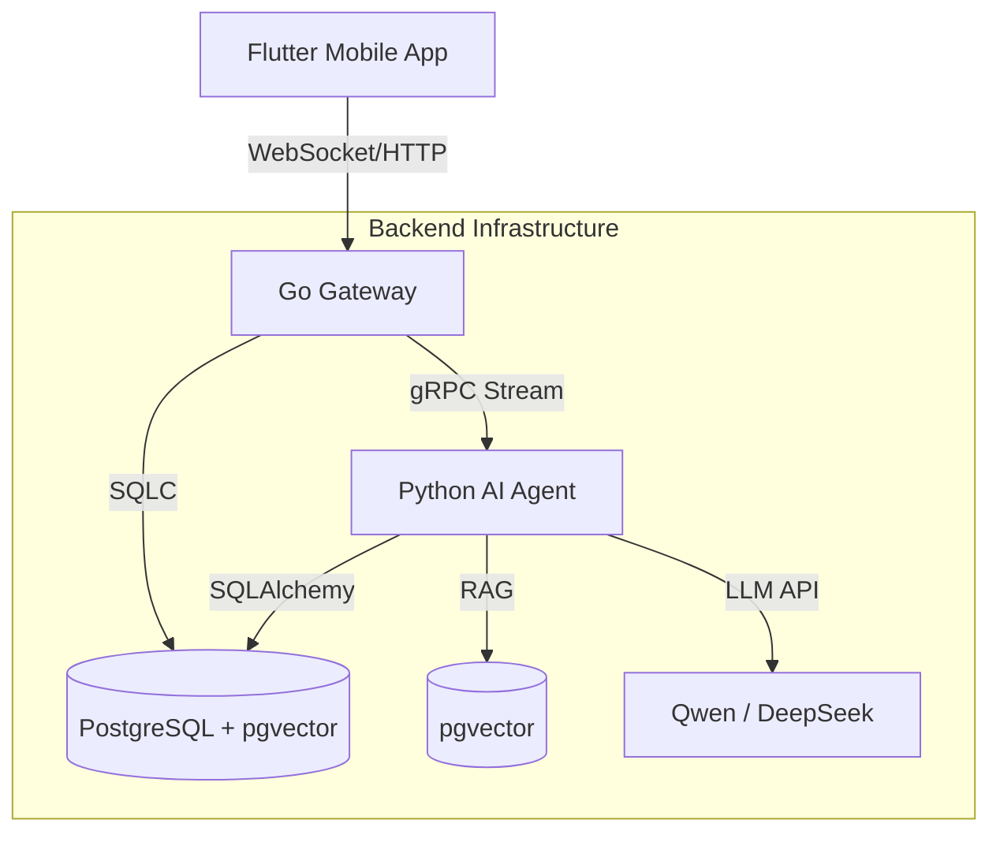

# Sparkle (星火) - 项目协作概览 (For Alibaba Cloud Team)

**日期**: 2025-12-29
**项目代号**: Sparkle
**当前阶段**: Phase 4 - 深度智能闭环 (P0 已完成)

---

## 1. 项目背景与愿景

**Sparkle (星火)** 是一款专为大学生打造的 **AI 驱动学习助手**。我们的目标不是做一个简单的 Todo List 或 聊天机器人，而是构建一位“高情商、懂节奏”的 **AI 时间导演**。

### 核心价值
- **短期**: 帮助学生稳住每一次关键节点（期末考、DDL、竞赛）。
- **长期**: 辅助构建个人知识体系，形成“学习-反馈-成长”的闭环。

### 目标场景
- **考前冲刺**: 智能拆解复习计划，动态调整每日任务。
- **碎片学习**: 利用 5-10 分钟空隙完成一个微任务（刷题、背词、纠错）。
- **知识管理**: 通过“知识星图”可视化掌握程度与薄弱点。

---

## 2. 技术架构 (Hybrid Microservices)

项目采用 **Go + Python 混合微服务架构**，充分利用 Go 的高并发能力与 Python 的 AI 生态优势。

### 2.1 架构全景

### 2.2 核心组件
| 组件 | 技术栈 | 职责 |
| :--- | :--- | :--- |
| **Mobile App** | Flutter 3.x, Riverpod | 用户交互、实时动效 (Shader)、本地状态管理 |
| **Gateway** | Go (Gin), Gorilla WebSocket | **流量入口**。处理高并发长连接、鉴权、协议转换、基础 CRUD |
| **AI Engine** | Python (FastAPI/gRPC), LangChain | **大脑**。负责 LLM 推理、RAG 检索、工具调用、复杂业务逻辑 |
| **Database** | PostgreSQL 16 + pgvector | 统一存储结构化业务数据与非结构化向量数据 |
| **Cache/Queue** | Redis | 会话缓存、限流、简易消息队列 |

---

## 3. 关键里程碑与进度

项目目前处于 **Phase 4 (深度智能与体验优化)** 阶段，目标是在 **2025年2月2日** 前完成 MVP 以参加大学生软件创新大赛。

### ✅ 已完成 (Done)
- [x] **混合架构重构**: 完成从 Python 单体向 Go+Python 微服务的迁移。
- [x] **P0 上下文闭环**: Go Gateway 实现了用户实时状态（任务、计划、专注度）的聚合，并通过 gRPC 注入 AI 上下文，使 AI 回复具备极高的场景相关性。
- [x] **核心功能**: 知识星图 (RAG)、智能任务生成、社群/好友系统、实时流式对话。
- [x] **基础设施**: Docker Compose 编排、Protobuf 接口定义标准化。

### 🚧 进行中 (In Progress)
- [ ] **P1 计划执行增强**: 实现 AI 自动拆解长期计划为微任务 (Task Generation Tool)。
- [ ] **P2 多模态交互**: 引入语音输入与更丰富的视觉反馈。
- [ ] **P3 生产环境部署**: 阿里云容器服务 (ACK) 或 ECS 部署准备。

---

## 4. 阿里云协作/部署需求概览 (Draft)

为了支撑上线与竞赛演示，我们可能需要以下云资源或技术支持：

1.  **计算资源**:
    - **应用服务**: 容器服务 (ACK/ASK) 或 ECS (部署 Go Gateway & Python Agent)。
    - **数据库**: RDS for PostgreSQL (需支持 `pgvector` 插件)。
    - **缓存**: 云数据库 Redis 版。

2.  **AI/模型服务**:
    - **Model Serving**: 考虑使用 **阿里云百炼 (Model Studio)** 接入通义千问 (Qwen-Turbo/Max) 以获得更低的延迟与更优的中文理解能力。
    - **Embedding**: 使用阿里云提供的向量嵌入服务优化 RAG 检索效果。

3.  **网络与安全**:
    - SLB (负载均衡) 处理 WebSocket 长连接分发。
    - API 网关 (可选) 进行统一流量管理。

---

## 5. 项目资源索引

- **源代码**: [GitHub Repository] (当前目录)
- **技术文档**: `docs/`
    - 架构详解: `docs/00_项目概览/02_技术架构.md`
    - API 参考: `docs/02_技术设计文档/03_API参考.md`
- **演示/测试**:
    - 本地启动: `make dev-all` (需 Docker 环境)

---
*Generated by Gemini CLI for Alibaba Cloud Collaboration Team*
